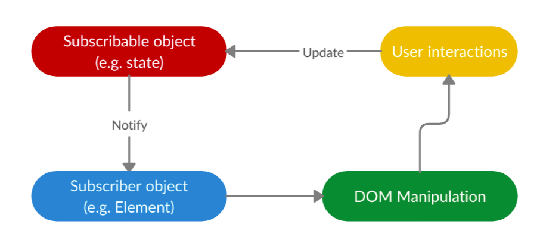

# Spreax


Spreax is a [lightweight](https://bundlephobia.com/result?p=spreax), modern library to help you make pure web applications, without any bloat and Virtual DOM stuff. ⚡️

In fact, Spreax isn't created to do anything new; **It only takes care of the state and synchronizes the UI with it.**

# How?
Spreax doesn't render anything. Instead, after every state change, it updates the elements (their text content, attributes, ...) to synchronize the UI with the state. 



# Get Started
Install it by executing:
```sh
npm i spreax # npm
yarn add spreax # npm
```
See more in [Installtion docs](docs/installation.md).

# Docs
See [docs folder](docs).

# TypeScript Support
Spreax itself is fully written in TypeScript, and it also includes definitions.
