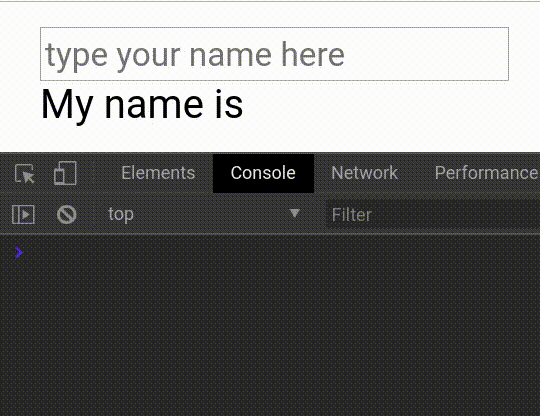

# Inputs
As Spreax's main duty is making interactivity, Spreax can handle user inputs well, thanks to `sp-model` directive.
```html
<input type="text" sp-model='name' placeholder='type your name here'>
<div>My name is {{ name }}</div>
```
```js
new Spreax(el, {
	state: {
		name: ''
	}
})
```
Whenever user types into the input (or any modification, like `input.value = "something"`), `name` property changes. and, when you assign a value to `name`, that will be reflected into input. This is called **two-way binding**. 


> if you define and initial value in `value` attribute of input, Spreax will ignore that. If you want the input to have an initial value, define it in `name` property.
## Other types of inputs
### Checkboxes
```html
<input type="checkbox" sp-model='check'>
```
The reflected value will be a **boolean** 
### Select elements
```html
<select sp-model="name">
	<option>Option 1</option>
	<option>Option 2</option>
	<option>Option 3</option>
	<option>Option 4</option>
	<option>Option 5</option>
</select>
```